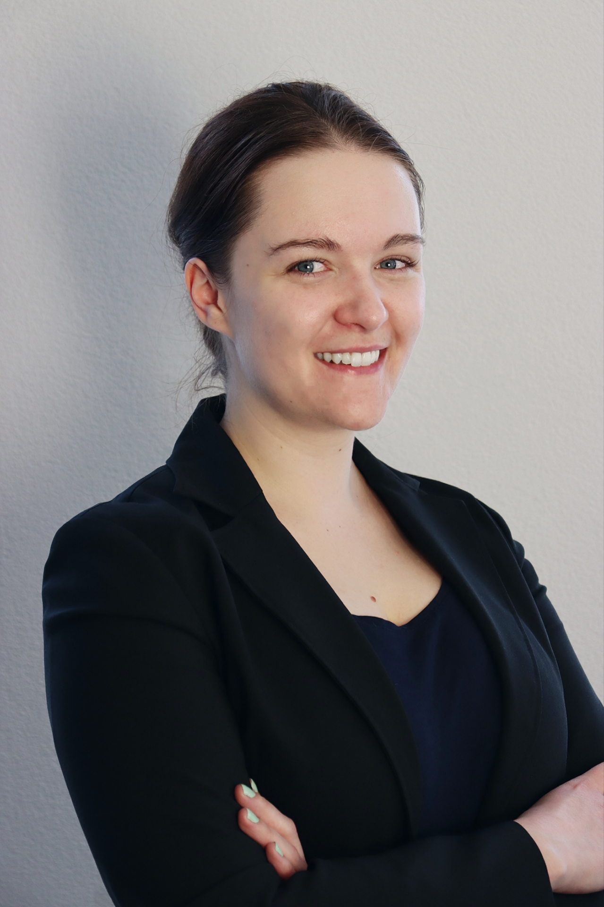

::: {.page-container}

::: {.content-page}

# Research

::: {.research-intro}

::: {.research-intro-card}

::: {.small-label}
RESEARCH PROFILE
:::

My research examines how social inequalities shape health and healthcare trajectories across the life course. I am especially interested in how socioeconomic disadvantage accumulates over time, how preventive healthcare systems reach different groups, and how complexity-informed approaches can help explain unequal patterns of care.

Across my work, I ask how health inequalities emerge, persist, and sometimes widen within systems that are formally designed to protect health. This includes attention to family background, education, linked lives, institutional contexts, healthcare access, and the timing and regularity of preventive care.

:::

::: {.research-photo-wrap}

{.research-photo}

:::

:::

## Research agenda

::: {.agenda-grid}

::: {.agenda-item .agenda-teal}

### Life-course inequalities

I study how social and socioeconomic disadvantage shape health across lives and generations. This includes work on educational trajectories, family background, multimorbidity, longevity, and healthcare uptake.

:::

::: {.agenda-item .agenda-rose}

### Preventive healthcare systems

A central part of my current work focuses on preventive healthcare, including screening, routine monitoring, vaccination, and chronic disease management. I am interested in why prevention can remain unequal even in contexts with broad healthcare access.

:::

::: {.agenda-item .agenda-gold}

### Complexity and health equity

My emerging research agenda brings life course epidemiology into conversation with complexity science. This includes attention to feedback, timing, adaptation, linked lives, institutional contexts, and unintended consequences in health systems.

:::

:::

## Research approach

My work is primarily quantitative and population-based, with a strong interest in longitudinal methods. I use large-scale survey and cohort data to study how social inequalities unfold over time, and I am increasingly interested in combining these methods with systems thinking and participatory approaches.

Methodologically, my work draws on:

- life course epidemiology;
- longitudinal and sequence analysis;
- social epidemiology and health sociology;
- healthcare services research;
- complexity-informed approaches to health systems.

## Current directions

I am currently developing a research programme on unequal preventive healthcare trajectories. This work asks how social inequalities shape the timing, regularity, and continuity of preventive care, and how healthcare systems may unintentionally reinforce unequal patterns of use.

Future work will further connect life course research with complexity science, participatory systems mapping, and cohort or registry-based data where possible.

[See publications](publications.qmd){.button-primary}

:::

:::