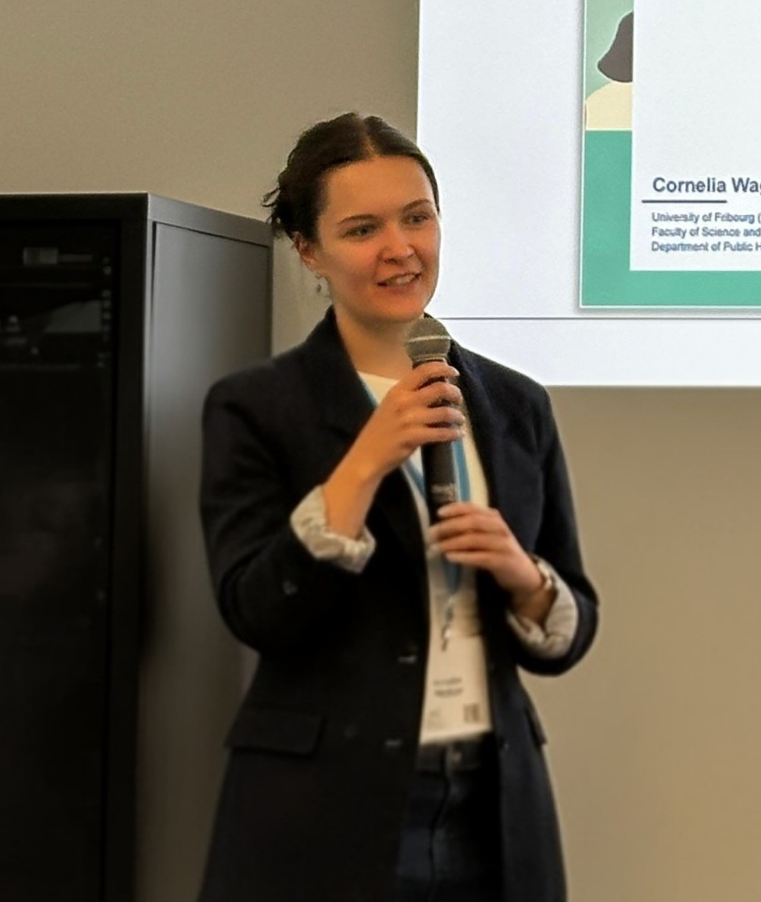

::: {.page-container}

::: {.content-page}

# Talks & Teaching

I present my work at conferences, workshops, and invited seminars, and I contribute to teaching in life course epidemiology, public health, and social inequalities in health.

## Where I’ll be

If you will be nearby and would like to connect, feel free to reach out.

::: {.where-list}

::: {.where-item}
**Hamburg, Germany** · 19–21 August 2026  
European Society of Health and Medical Sociology Conference
:::

::: {.where-item}
**Lucerne, Switzerland** · 2–3 September 2026  
Swiss Public Health Conference
:::

::: {.where-item}
**London, United Kingdom** · 9–11 September 2026  
Society for Social Medicine & Population Health Annual Conference / European Congress of Epidemiology
:::

:::

## Topics I speak and teach on

::: {.teaching-section}

::: {.teaching-image}
{fig-alt="Cornelia Wagner teaching"}
:::

::: {.teaching-box}
- Life course epidemiology
- Social inequalities in health
- Complexity science and public health
- Preventive healthcare
- Longitudinal and sequence analysis
:::

:::

## Selected recent talks

::: {.compact-list}

::: {.compact-item}
**Socioeconomic determinants and chronic disease: tracking inequality through the life course**  
European Public Health Association Chronic Disease Section, online webinar series, 2025.
:::

::: {.compact-item}
**A life course perspective on socioeconomic determinants of health inequalities**  
Department of Sociology, Ghent University, 2025.
:::

::: {.compact-item}
**Life-course disadvantage and healthcare trajectories**  
Presented at meetings including the Society for Longitudinal and Lifecourse Studies Annual Conference, LIVES Day, and the European Public Health Conference.
:::

:::

## Teaching

My teaching focuses on life course epidemiology, public health, social inequalities in health, and community health. I have contributed to teaching at the University of Fribourg, SSPH+, the Society for Longitudinal and Lifecourse Studies Summer School, and Université Paris-Est Créteil Val-de-Marne.

:::

:::
