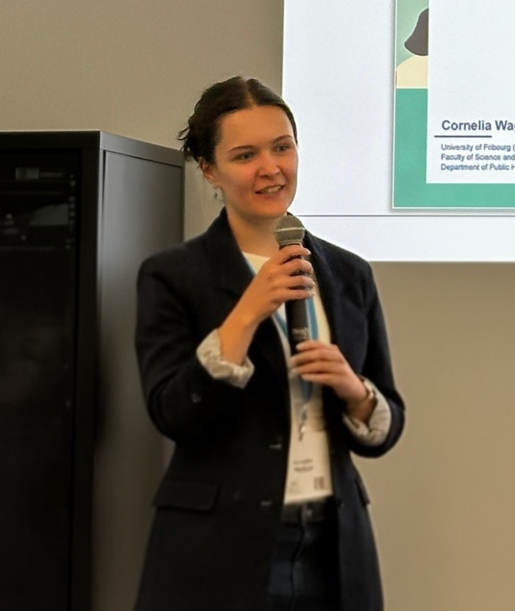

::: {.page-container}

::: {.content-page}

# Talks & Teaching

I present my work at conferences, workshops, and invited seminars, and I contribute to teaching in life course epidemiology, public health, and social inequalities in health.

## Where I’ll be

If you will be nearby and would like to connect, feel free to reach out.

::: {.where-list}

::: {.where-item}
**Paris, France** · February 2027  
Invited research seminar
:::

::: {.where-item}
**Copenhagen, Denmark** · 16 April 2027  
Inaugural Health Complexity Conference
:::

:::

## Topics I speak and teach on

::: {.teaching-section}

::: {.teaching-image}
{fig-alt="Cornelia Wagner teaching"}
:::

::: {.teaching-box}
- Life course epidemiology
- Social inequalities in health
- Complexity science and public health
- Preventive healthcare
- Longitudinal and sequence analysis
:::

:::

## Selected recent talks and presentations

::: {.compact-list}

::: {.compact-item}
**Migration and life-course trajectories of preventive healthcare uptake in Europe**
Society for Social Medicine & Population Health Annual Conference / European Congress of Epidemiology  
*London, United Kingdom, 9–11 September 2026*
:::

::: {.compact-item}
**Addressing thecomplexity in the room: an interdisciplinary workshop on how we can understand health complexity**
Swiss Public Health Conference
*Lucerne, Switzerland, 2–3 September 2026*
:::

::: {.compact-item}
**Migration and life-course patterns of preventive healthcare uptake in Europe**
European Society of Health and Medical Sociology Conference 2026 
*Hamburg, Germany, 19–21 August 2026*
:::

::: {.compact-item}
**Socioeconomic determinants and chronic disease: tracking inequality through the life course**  
European Public Health Association Chronic Disease Section, online webinar series, 2025.
:::

:::

## Teaching

My teaching focuses on life course epidemiology, public health, social inequalities in health, and community health. I have contributed to teaching at the University of Fribourg, SSPH+, the Society for Longitudinal and Lifecourse Studies Summer School, and Université Paris-Est Créteil Val-de-Marne.

:::

:::
